<div align="center">

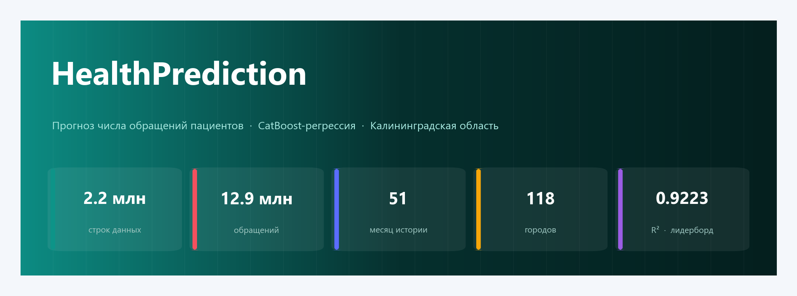

<p>
  
  
  
  
  
  
</p>

**Прогноз числа обращений пациентов по полу, диагнозу (МКБ-10), городу и месяцу**
<br>Решение задачи регрессии на данных здравоохранения Калининградской области

</div>

---

## 📋 О проекте

`HealthPrediction` — решение соревнования по машинному обучению, в котором требуется
**предсказать число пациентов** (`PATIENT_ID_COUNT`), которые обратятся с конкретным
диагнозом в апреле 2022 года — в разрезе:

| Признак | Описание |
|---|---|
| `PATIENT_SEX` | пол пациента (кодировка 0 / 1) |
| `MKB_CODE` | код заболевания по классификатору **МКБ-10** |
| `ADRES` | населённый пункт Калининградской области |
| `VISIT_MONTH_YEAR` | месяц и год обращения |
| `AGE_CATEGORY` | возрастная категория (дети … долгожители) |
| **`PATIENT_ID_COUNT`** | **целевая переменная** — число обратившихся пациентов |

В основе решения — градиентный бустинг **CatBoost** с продуманной инженерией признаков
и многоступенчатой постобработкой редких значений. Лучший результат — **R² = 0.9223**
на лидерборде соревнования.

<div align="center">

|  📦 Строк данных | 🩺 Обращений | 🗓 Месяцев истории | 🏙 Городов | 🔢 Кодов МКБ |
|:---:|:---:|:---:|:---:|:---:|
| **2 212 393** | **12 937 750** | **51** (01.2018 – 03.2022) | **118** | **7 644** |

</div>

---

## 🔍 Исследование данных (EDA)

Все графики ниже строятся одним скриптом [`visualize.py`](visualize.py) прямо из `train.csv`
и собраны в едином визуальном стиле.

### 1. Динамика обращений во времени

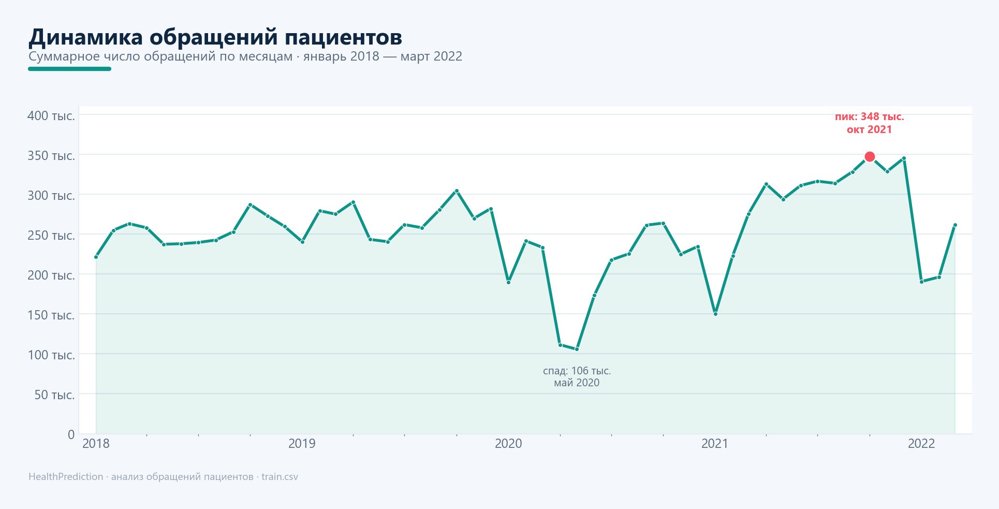

> Хорошо виден **провал весны 2020** (локдаун COVID-19): в мае 2020 число обращений
> упало до ~106 тыс. — почти втрое относительно пика. Затем — восстановление и
> исторический максимум в октябре 2021 (~348 тыс.).

### 2. Сезонность обращаемости

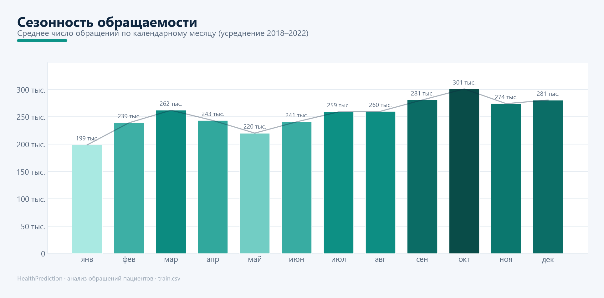

> Усреднение по годам убирает перекос из-за неравного числа месяцев. Чётко
> прослеживается **осенний всплеск** (сентябрь–октябрь) и **летне-зимние спады** —
> классический профиль диспансеризации и сезонных заболеваний.

### 3. Структура заболеваемости

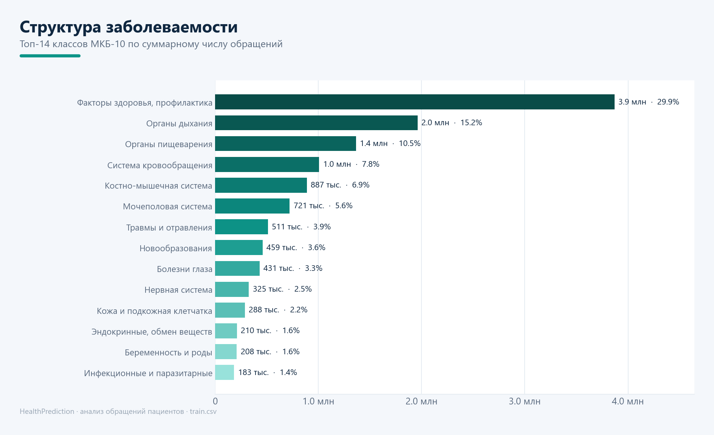

> Почти **треть всех обращений** — класс «Факторы, влияющие на здоровье, и профилактика»
> (диспансеризация, осмотры). Далее — болезни органов дыхания и пищеварения.

### 4. Обращения по возрасту и полу

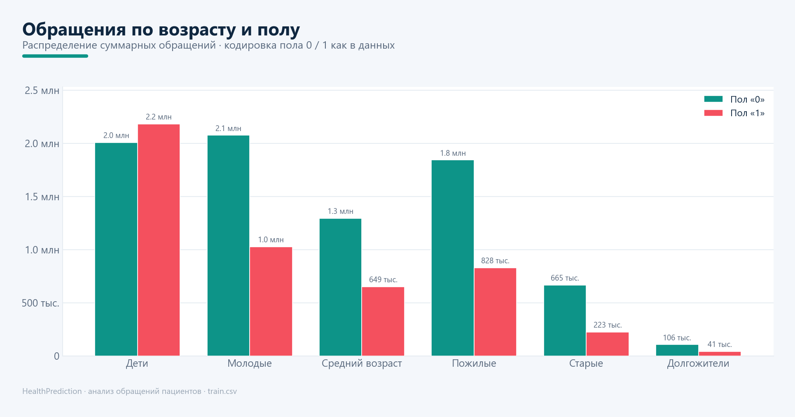

> Наибольшая нагрузка приходится на детей и молодёжь. С возрастом обращаемость
> по обеим группам пола снижается — закономерно для структуры населения.

### 5. Распределение размера групп — «длинный хвост»

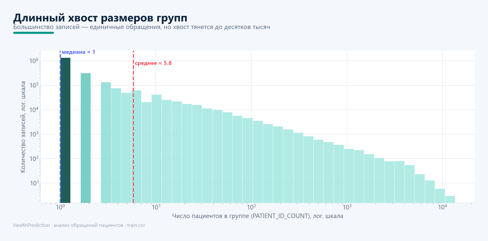

> Медиана = 1: большинство записей — единичные обращения. Но распределение имеет
> **тяжёлый хвост** (до 13 532 пациентов в одной группе), из-за чего среднее (≈5.8)
> заметно выше медианы. Это ключевая особенность для выбора модели и постобработки.

### 6. Города: население и обращаемость

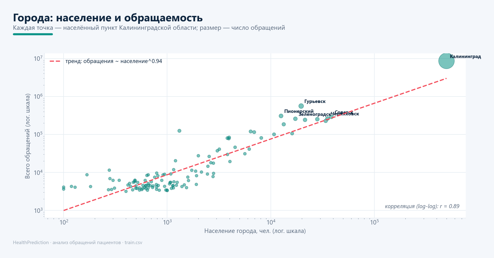

> Сильная связь в лог-лог координатах (**r = 0.89**): число обращений растёт почти
> линейно с населением города. Калининград ожидаемо доминирует.

### 7. Сезонные профили заболеваний

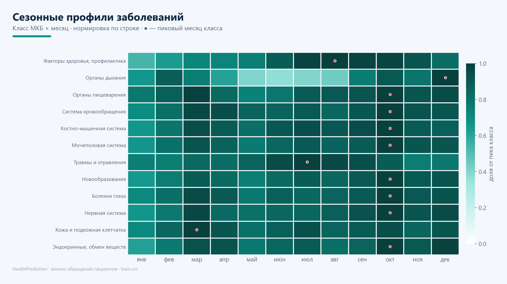

> Каждая строка нормирована на свой пик. **Болезни органов дыхания** пикуют зимой
> (классическая простудная сезонность с летним провалом), **травмы** — летом,
> хронические и профилактические обращения — в октябре.

### 8. Возрастной профиль заболеваний

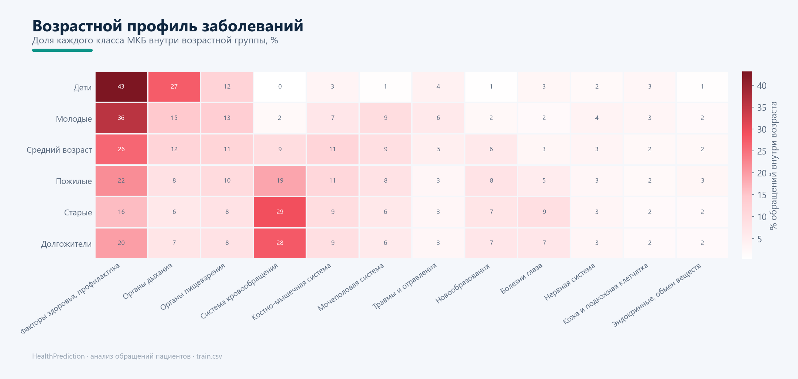

> У детей доминируют болезни органов дыхания (27%), у пожилых и старых — болезни
> системы кровообращения (до 29%). Профиль заболеваний закономерно «дрейфует» с возрастом.

---

## 🧠 Методология решения

### Инженерия признаков — [`augmentation.py`](augmentation.py)
- `DISEASE_PART` — класс заболевания (отбрасывание индекса у кода МКБ);
- `CITIZENS` — численность населения города (справочник из открытых источников);
- `CITY_TYPE` — категория города по населению (BIG / MIDDLE / SMALL / MICRO);
- перевод даты в число месяцев от опорной точки;
- встроенный классификатор МКБ-10 на 21 класс и 260+ подклассов.

### Модель — [`solution.py`](solution.py)
**CatBoostRegressor** (обучение на GPU) с подобранными случайным поиском
гиперпараметрами (`depth=10`, `learning_rate=0.14`, `iterations=7000`,
`bagging_temperature`, `random_strength`, `min_data_in_leaf`, `max_bin`),
ранней остановкой и выбором лучшей модели по контрольной выборке. При запуске
создаёт `result_pure.csv`.

### Подбор гиперпараметров — [`optimization.py`](optimization.py)
Случайный поиск по сетке параметров с фиксированным `SEED` для воспроизводимости.
У CatBoost есть встроенный поиск, но он не сравнивает модели по заданной функции
с тестовой выборкой — здесь эта логика реализована явно.

### Постобработка — [`prepare_data.py`](prepare_data.py)
Для ключей с **недостаточным числом исторических наблюдений** предсказание модели
заменяется на эвристику (последнее / среднее / среднее за 2022 год). При достижении
моделью R² > 0.9 это даёт примерно **+0.002** к Score — небольшой, но честный прирост
там, где данных модели объективно не хватает. Наибольший эффект давал вариант
«по последнему известному значению» (`result_prepared_last.csv`) — именно он
отправлялся на лидерборд.

> 💡 **Наблюдение автора:** встроенный классификатор болезней (21 класс МКБ) в процессе
> исследования был отброшен как не улучшающий модель. Вывод: *«классификатор болезней
> не отражает истинную взаимосвязь разных заболеваний»*.

### Значимость признаков

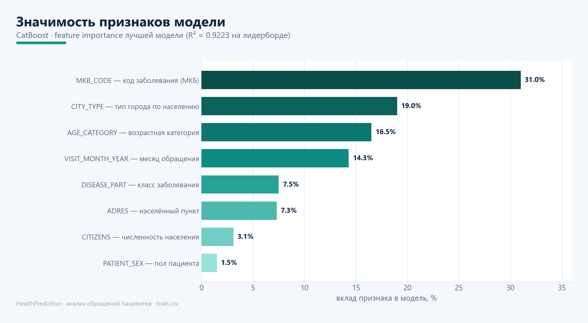

> Код заболевания (`MKB_CODE`) — самый сильный предиктор. Пол пациента (`PATIENT_SEX`) —
> наименее значим: болезни в данных уже во многом распределены по полу. Именно это
> наблюдение легло в основу «упрощённого ключа» в постобработке.

> 🏙 **Наблюдение автора:** любопытна высокая значимость типа города (крупный / мелкий /
> деревня / ещё мельче). *«Ранее я думал, может стоит переехать в маленький город.
> Теперь понимаю, что это не самая лучшая идея»*.

---

## 🏆 Результат

Лучший результат решения — **R² = 0.9223**. Итоговый лидерборд соревнования:

<div align="center">

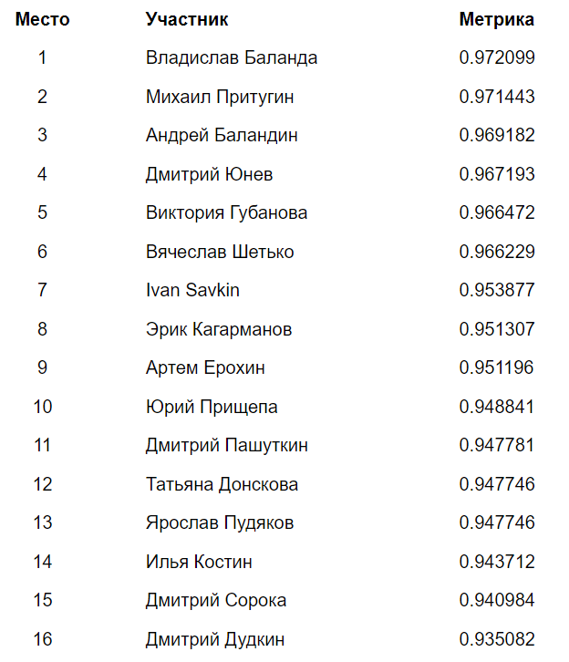

</div>

---

## 🗂 Структура проекта

```
HealthPrediction/
├── solution.py            # обучение CatBoost и формирование предсказаний
├── augmentation.py        # инженерия признаков + классификатор МКБ-10
├── prepare_data.py        # постобработка редких значений
├── optimization.py        # случайный поиск гиперпараметров
├── utility.py             # вспомогательные функции (CSV, графики)
├── visualize.py           # построение аналитических графиков (этот README)
├── charts/                # сгенерированные графики
├── train.csv / test.csv   # исходные данные соревнования
├── leaderboard.png        # итоговый лидерборд
└── HealthPrediction.pdf   # описание задачи
```

---

## 🚀 Как воспроизвести графики

```bash
# зависимости для визуализации
pip install pandas numpy matplotlib

# построить все графики из train.csv в каталог charts/
python visualize.py
```

Для обучения модели дополнительно потребуются `catboost` и `scikit-learn`
(а также `train.csv` / `test.csv`):

```bash
pip install catboost scikit-learn
python solution.py        # обучение и предсказание -> result_pure.csv
python prepare_data.py    # постобработка -> result_prepared_*.csv
```

---

## 🛠 Технологии

`Python` · `CatBoost` · `pandas` · `NumPy` · `scikit-learn` · `matplotlib`

---

<div align="center">
<sub>Автор: <a href="https://github.com/VladimirTalyzin">Vladimir Talyzin</a> · графики и оформление сгенерированы скриптом <code>visualize.py</code></sub>
</div>
